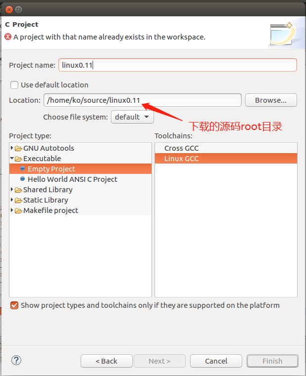
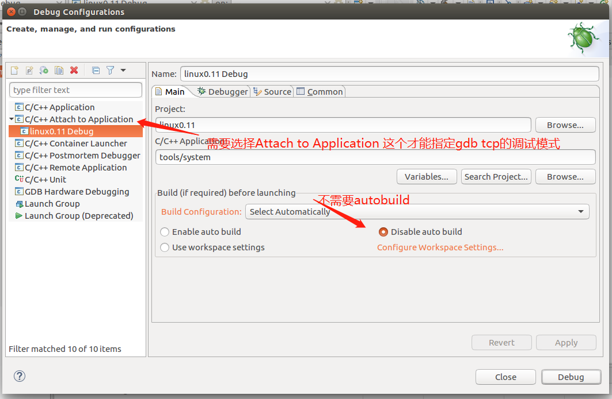
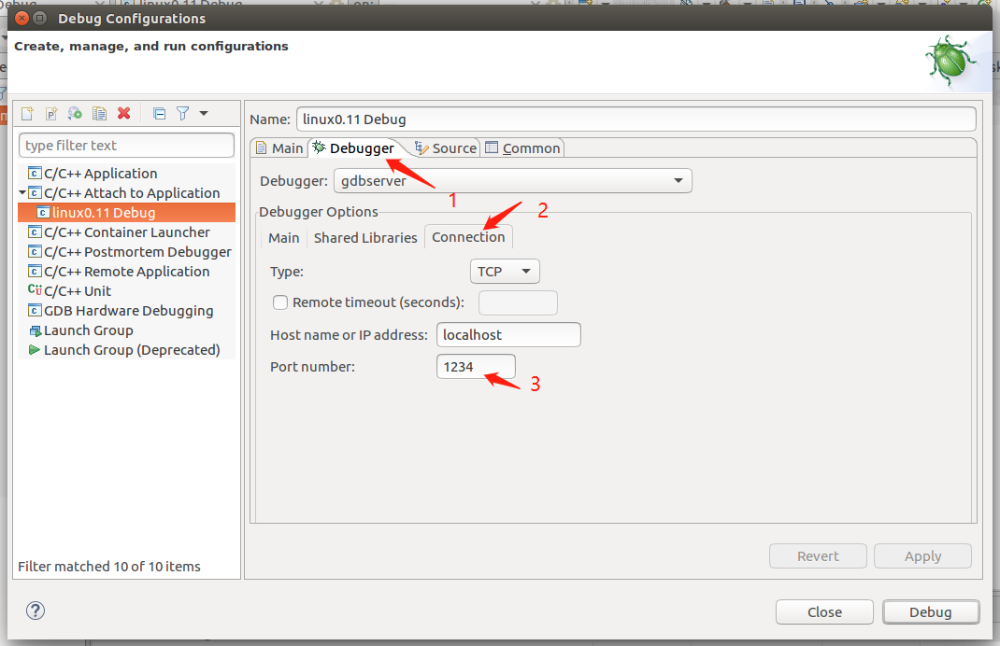
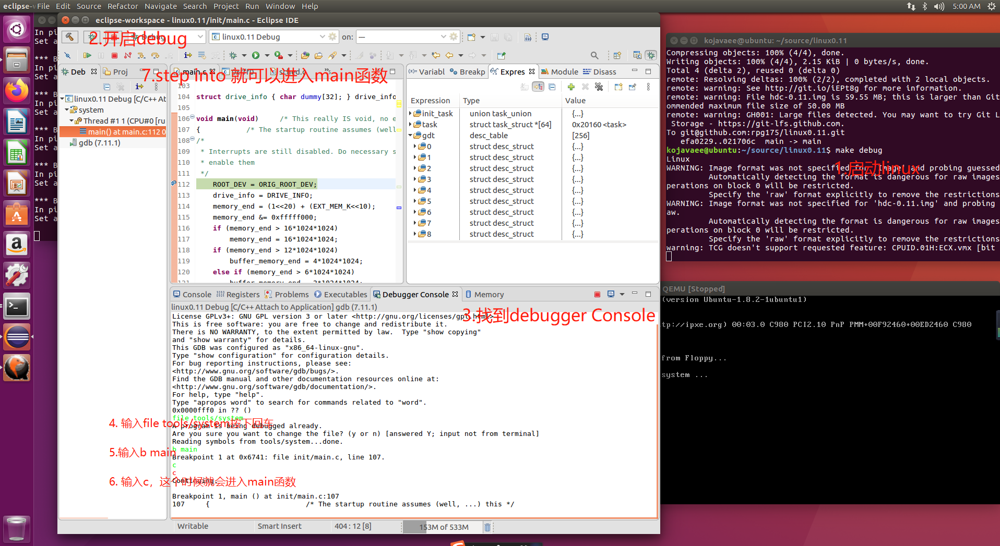

# Linux 0.11 debug by eclipse + gdb

实验使用的软件版本
* ubuntu-16.04.7-desktop-amd64
* jdk-8u91-linux-x64
* eclipse-cpp-2019-03-R-linux-gtk-x86_64
* 使用的linux版本[Running_Linux0.11](https://github.com/Original-Linux/Running_Linux0.11)，该版本支持ubuntu-16.04
* 安装qemu `sudo apt-get install qemu`

## Linux start by qemu

Build Linux-0.11
```
make
``` 

Boot Linux-0.11 on qemu
```
make start
```

Debug Linux-0.11 in GDB
```
make debug
```

## Eclipse + Gdb debug linux

### Eclipse的配置

启动Eclipse，`Window->Preferences->General->Workspace` 中的`Build Automatically`选项去掉。

### Eclipse导入linux0.11源码


### Eclipse导入linux0.11配置debug




* 完成eclipse配置点击`debug`，在点击debug的前，先要在terminal启动linux，即`make debug`
* 在eclipse Debugger Console 输入对应得gdb命令

### 愉快的开始Debug



1. terminal中在linux0.11的目录下输入`make debug`
2. eclipse 开始debug
3. 打开eclipse的debuggerconsole ，输入对应得gdb命令
4. 看上图

Debugger Console
```
(gdb)file tools/system //加载符号
(gdb)directory ./linux0.11 //设置源码目录 可以不设置
(gdb)set architectur i8086  // 设置成i8086模式，用来调试16位室模式代码，可以不设置
(gdb)set disassembly-flavor intel //将汇编显示成intel 格式，好看一些，可以不设置
(gdb)b *0x7c00 // 在地址0x7c00处打断点 可以不设置，我一般直接断点 main函数
(gdb)layout split  
(gdb)c
```

```
(gdb)x/16xb 0x7DF0
```
单步执行
```
si
```
断点main函数
```
b main
```
